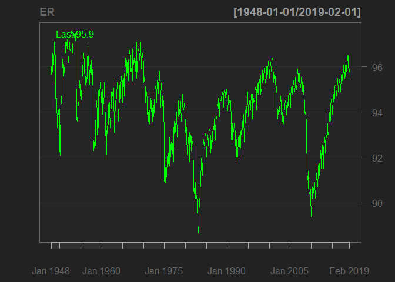

Times Series Forecasting
================
Erika Vargas
January 30, 2019

``` r
##libraries needed
library(quantmod) # use for gathering and charting economic data
```

    ## Loading required package: xts

    ## Loading required package: zoo

    ## 
    ## Attaching package: 'zoo'

    ## The following objects are masked from 'package:base':
    ## 
    ##     as.Date, as.Date.numeric

    ## Loading required package: TTR

    ## Version 0.4-0 included new data defaults. See ?getSymbols.

``` r
library(lubridate) # date functions
```

    ## 
    ## Attaching package: 'lubridate'

    ## The following object is masked from 'package:base':
    ## 
    ##     date

``` r
library(latticeExtra) # package used for horizon plot
```

    ## Loading required package: lattice

    ## Loading required package: RColorBrewer

``` r
library(forecast) # functions for time series forecasting 
library(lmtest) # for Granger test of causality

par(mfrow = c(2,2)) # four plots on one window/page
```

``` r
# Economic Data from Federal Reserve Bank of St. Louis (FRED system)
# National Civilian Unemployment Rate (monthly, percentage)
getSymbols("UNRATENSA", src="FRED", return.class = "xts")
```

    ## 'getSymbols' currently uses auto.assign=TRUE by default, but will
    ## use auto.assign=FALSE in 0.5-0. You will still be able to use
    ## 'loadSymbols' to automatically load data. getOption("getSymbols.env")
    ## and getOption("getSymbols.auto.assign") will still be checked for
    ## alternate defaults.
    ## 
    ## This message is shown once per session and may be disabled by setting 
    ## options("getSymbols.warning4.0"=FALSE). See ?getSymbols for details.

    ## [1] "UNRATENSA"

``` r
ER <- 100 - UNRATENSA # convert to employment rate
dimnames(ER)[2] <- "ER"
chartSeries(ER,theme="black")
```



``` r
ER.data.frame <- as.data.frame(ER)
ER.data.frame$date <- ymd(rownames(ER.data.frame))
ER.time.series <- ts(ER.data.frame$ER, 
  start = c(year(min(ER.data.frame$date)),month(min(ER.data.frame$date))),
  end = c(year(max(ER.data.frame$date)),month(max(ER.data.frame$date))),
  frequency=12)
```

``` r
# Manufacturers' New Orders: Durable Goods (millions of dollars) 
getSymbols("DGORDER", src="FRED", return.class = "xts")
```

    ## [1] "DGORDER"

``` r
DGO <- DGORDER/1000 # convert to billions of dollars
dimnames(DGO)[2] <- "DGO" # use simple name for index
chartSeries(DGO, theme="black") 
```


``` r
DGO.data.frame <- as.data.frame(DGO)
DGO.data.frame$DGO <- DGO.data.frame$DGO
DGO.data.frame$date <- ymd(rownames(DGO.data.frame))
DGO.time.series <- ts(DGO.data.frame$DGO, 
  start = c(year(min(DGO.data.frame$date)),month(min(DGO.data.frame$date))),
  end = c(year(max(DGO.data.frame$date)),month(max(DGO.data.frame$date))),
  frequency=12)
```

``` r
# University of Michigan Index of Consumer Sentiment (1Q 1966 = 100)
getSymbols("UMCSENT", src="FRED", return.class = "xts")
```

    ## [1] "UMCSENT"

``` r
ICS <- UMCSENT # use simple name for xts object
dimnames(ICS)[2] <- "ICS" # use simple name for index
chartSeries(ICS, theme="black")
```


``` r
ICS.data.frame <- as.data.frame(ICS)
ICS.data.frame$ICS <- ICS.data.frame$ICS
ICS.data.frame$date <- ymd(rownames(ICS.data.frame))
ICS.time.series <- ts(ICS.data.frame$ICS, 
  start = c(year(min(ICS.data.frame$date)), month(min(ICS.data.frame$date))),
  end = c(year(max(ICS.data.frame$date)),month(max(ICS.data.frame$date))),
  frequency=12)
```

``` r
# New Homes Sold in the US, not seasonally adjusted (monthly, millions)
getSymbols("HSN1FNSA",src="FRED",return.class = "xts")
```

    ## [1] "HSN1FNSA"

``` r
NHS <- HSN1FNSA
dimnames(NHS)[2] <- "NHS" # use simple name for index
chartSeries(NHS, theme="black")
```


``` r
NHS.data.frame <- as.data.frame(NHS)
NHS.data.frame$NHS <- NHS.data.frame$NHS
NHS.data.frame$date <- ymd(rownames(NHS.data.frame))
NHS.time.series <- ts(NHS.data.frame$NHS, 
  start = c(year(min(NHS.data.frame$date)),month(min(NHS.data.frame$date))),
  end = c(year(max(NHS.data.frame$date)),month(max(NHS.data.frame$date))),
  frequency=12)
```

``` r
# define multiple time series object
economic.mts <- cbind(ER.time.series, DGO.time.series, ICS.time.series,
  NHS.time.series) 
  dimnames(economic.mts)[[2]] <- c("ER","DGO","ICS","NHS") # keep simple names 
modeling.mts <- na.omit(economic.mts) # keep overlapping time intervals only
```

Part 1. Multiple Time Series of Economic Data
=============================================

``` r
# plot 1
plot(modeling.mts, main = "Indicators of Economic Data from 1995 - 2015")
```


**This graph is great to observe the economy downhill behavior during the great recession (2007-2010). The four indicators show a significantly decrease from mid 2000s until beginning of 2010. The economy was suffering badly, consumers were afraid of the economy that’s is reflected in the ICS indicator. A lot of people were laid off that shows the decrease in employment rate. People were not spending money; hence, companies were not selling, and production just went down affecting not only the United States but the whole world in general.
Another interesting pattern I saw is the slightly decrease in early 2000s of employment rate, durable goods, and index consumer sentiment. I believe this trend was due to the IRAQ war. Terrorism in that time affected the US economy, not as bad as the housing financial bubble, but we can see that the index of consumer sentiment decreased as a result of frightening attacks such as September 11 attack. **

``` r
## Plot 2 

ER <- plot(ER.time.series, col = "blue", xlab= "years", ylab= "%", main=" Employment Rate")
```


*In this graph we can appreciate the different periods of time were the percentage of unemployment rates has increased and affected the US economy. The most significant are around 1980s (Reagan’s recession), early 2000s (Iraq war), and 2008 (great recession)*

``` r
DGO <- plot(DGO.time.series, col = "red", xlab= "years", ylab= "Billions of Dollars", main= "Durable Goods Orders")
```


*The durable good indicator shows the significant decrease of Manufacturer’s new orders during the great recession. We can also see a moderate decrease in mid 2000s, and a significant peak at the end of 2015*

``` r
ICS <- plot(ICS.time.series,col = "green", xlab= "years", ylab= "1Q 1966 = 100", main= "Index Consumer Sentiment")
```


*The consumer sentiment index is a great indicator. If consumers are optimistic that means they will spend more and economy will behave positively, whereas, if consumers are pessimistic, they will think twice before spending money and economy could get tough. We can see the Reagan Recession in the 80s were most of the people did not trust the government and believe Reagan administration’s economic policies would make their personal financial situation worse. We also see the significant decrease of ICS during the great recession, as I explained before.*

``` r
NHS <- plot(NHS.time.series, col = "purple", xlab= "years", ylab= "Millions of Dollars", main= "New Homes Sold")
```


*This graph is very important to look at to see the increase of new homes sold right before the collapse of the financial in 2007-2008. We can see a constant increase of homes sold between 1990 and mid-2000s and then the drastic change reaching it lowest value in 2010, and after that the slow recovery of the economy.*

**I decided to look at US GDP to compare the time series and see the great recession reflected in GDP per capita in the US**

``` r
library(WDI) #Search, extractdata from the World Bank's World Development Indicators
```

    ## Warning: package 'WDI' was built under R version 3.5.2

    ## Loading required package: RJSONIO

    ## Warning: package 'RJSONIO' was built under R version 3.5.2

``` r
#"NY.GDP.PCAP.KD"    "GDP per capita (constant 2000 US$)" 
dat = WDI(indicator='NY.GDP.PCAP.KD', country='US', start=1990, end=2015)
library(ggplot2)
```

    ## Warning: package 'ggplot2' was built under R version 3.5.2

    ## 
    ## Attaching package: 'ggplot2'

    ## The following object is masked from 'package:latticeExtra':
    ## 
    ##     layer

``` r
ggplot(dat, aes(year, NY.GDP.PCAP.KD, color=country)) + geom_line() + 
    xlab('Year') + ylab('GDP per capita')
```


*In this graph we can see clearly the two most significant events that mark the US economy from 1990 to date. As I mentioned before in the Multiple times series economic data plot. The Iraq war in 2000s and the great recession in 2008 slowed the economy and affected multiple economic sectors and consumers confidence. We can see how economy seems stagnant in the period between 2000 and 2003 (Iraq war, 9-11), and then the positive growth until 2007 were the financial sector starts to identify the financial bubble that they were living in. It is clear how the GDP per capita went down significantly during this period and slightly starts to recover after 2010.*
